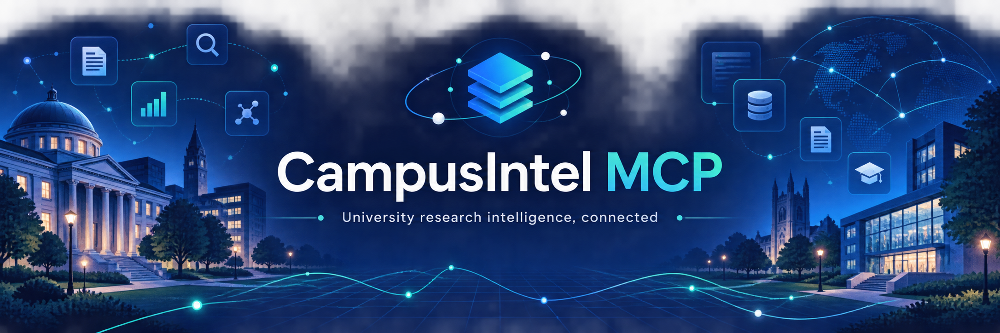
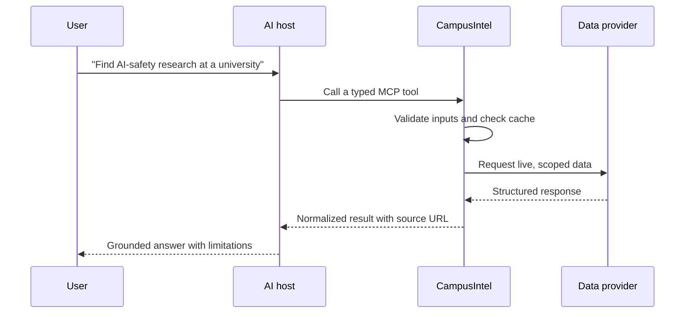
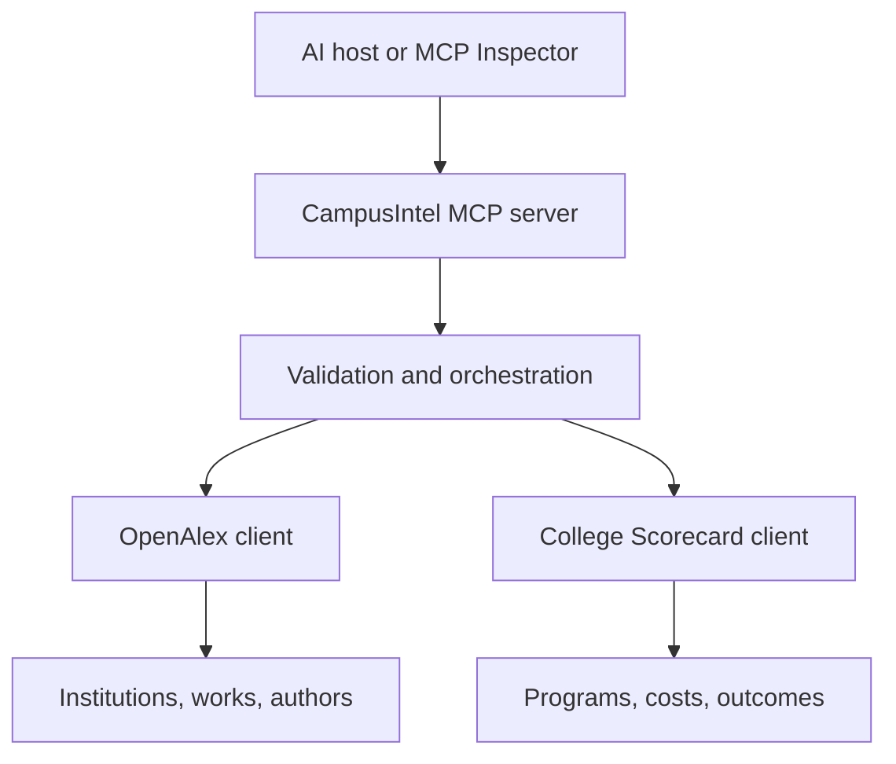

<p align="center">
  
</p>

<p align="center">
  <a href="https://github.com/acestein13/campusintel-mcp/actions/workflows/ci.yml"></a>
  
  
  <a href="LICENSE"></a>
</p>

# CampusIntel MCP

CampusIntel is a Model Context Protocol server that gives AI assistants structured access to
university research, researchers, academic programs, and institutional data. It combines the
[OpenAlex](https://openalex.org/) scholarly knowledge graph with the U.S. Department of
Education's [College Scorecard](https://collegescorecard.ed.gov/data/) while preserving source
links and limitations in every result.

The project is designed for research discovery and university investigation—not admissions
predictions or one-number rankings.

## What is an MCP server?

An MCP server is a small piece of infrastructure that lets an AI host—such as Claude Desktop,
VS Code, or the MCP Inspector—call reliable tools instead of guessing. Think of it as a secure
adapter between an AI assistant and outside data sources.

CampusIntel is **not** a college-advice chatbot and it does not use an LLM to invent university
facts. It exposes clearly named functions such as `search_research` and
`list_academic_programs`. The AI host decides when to call them; CampusIntel validates the
request, obtains live data from the appropriate source, and returns structured, source-linked
results the host can explain to the user.

## How a request works



For example, an AI host first calls `search_universities` to resolve a name to an OpenAlex
institution ID. It then passes that ID to `search_research` or `find_topic_researchers`. This
two-step pattern avoids ambiguous name matching and keeps research results tied to a specific
institution.

## What it can do

| Tool | Purpose | Data source |
|---|---|---|
| `search_universities` | Resolve university names to stable OpenAlex IDs | OpenAlex |
| `get_university_profile` | Research footprint plus optional U.S. federal metrics | Both |
| `search_research` | Find papers by topic, university, year, and open-access status | OpenAlex |
| `search_researchers` | Find researchers by name and affiliation | OpenAlex |
| `find_topic_researchers` | Discover researchers through relevant university papers | OpenAlex |
| `search_us_colleges` | Find U.S. colleges, costs, outcomes, and Scorecard IDs | College Scorecard |
| `list_academic_programs` | Filter fields of study and credential levels | College Scorecard |
| `compare_universities` | Produce a source-aware comparison for two to five schools | Both |
| `health_check` | Verify local provider configuration without exposing secrets | Local |

CampusIntel also exposes a `campusintel://methodology` resource and a reusable
`research_university_fit` prompt.

## Architecture



The provider clients include typed normalization, bounded retries, timeouts, and an in-memory TTL
cache. Cross-source matching is intentionally isolated in the service layer, so raw provider data
and inferred relationships are never confused.

## Where the information comes from

| Source | CampusIntel uses it for | Important context |
|---|---|---|
| [OpenAlex](https://openalex.org/) | Global universities, scholarly papers, authors, affiliations, topics, citations, and open-access links | It is an open scholarly index. Coverage and citation counts vary by field and publication age. |
| [College Scorecard](https://collegescorecard.ed.gov/data/) | U.S. programs, enrollment, cost, admissions, completion, and earnings fields | It is published by the U.S. Department of Education. Its `latest` metrics can come from different reporting cohorts. |

CampusIntel does not scrape faculty pages, use private student data, or claim it can predict an
applicant's admissions outcome. It preserves the provider URL with each returned record so a user
can check the primary data before relying on it.

## Quick start

### 1. Install

Install [uv](https://docs.astral.sh/uv/), then clone and sync the project:

```bash
git clone https://github.com/acestein13/campusintel-mcp.git
cd campusintel-mcp
uv sync --all-extras --dev
```

No virtual-environment activation is required when commands begin with `uv run`.

### 2. Configure provider keys

Copy `.env.example` to `.env`, then add your keys:

- `OPENALEX_API_KEY`: recommended for normal use; create a free key in
  [OpenAlex settings](https://openalex.org/settings/api).
- `COLLEGE_SCORECARD_API_KEY`: required for U.S. institutional and academic-program tools;
  request a free [data.gov API key](https://api.data.gov/signup/).

OpenAlex supports limited keyless demonstration requests. CampusIntel still works without a
College Scorecard key, but the U.S. college and program tools will return a clear configuration
error and profiles will omit Scorecard enrichment.

### Keep keys private

Never put a real key in `README.md`, source code, a committed `.env` file, a screenshot, or an
MCP configuration file you plan to share. This repository includes `.env.example` with blank
placeholders only, and `.gitignore` excludes `.env`.

Set `OPENALEX_API_KEY` and `COLLEGE_SCORECARD_API_KEY` as local environment variables, or place
their values only in your uncommitted `.env` file, then run `uv run campusintel-mcp`.
`health_check` reports only whether a provider is configured; it never returns secret values.

### 3. Test with MCP Inspector

macOS/Linux:

```bash
set -a && source .env && set +a
uv run mcp dev src/campusintel_mcp/server.py
```

Windows PowerShell:

```powershell
uv run mcp dev src/campusintel_mcp/server.py
```

Before running the Windows command, define `OPENALEX_API_KEY` and
`COLLEGE_SCORECARD_API_KEY` in your local PowerShell session or in an uncommitted `.env` file.

The Inspector opens in a browser. Start with `search_universities`, retain the returned OpenAlex
ID, and pass it into the research tools.

## Connect an MCP host

The repository includes ready-to-edit examples for
[Claude Desktop](examples/claude_desktop_config.json) and [VS Code](examples/vscode-mcp.json).
Replace the absolute path and keep real keys outside files you commit or share.

A generic stdio entry is:

```json
{
  "command": "uv",
  "args": ["--directory", "/ABSOLUTE/PATH/TO/campusintel-mcp", "run", "campusintel-mcp"]
}
```

## Streamable HTTP and Docker

Local stdio is the default. To run the same server over Streamable HTTP:

```bash
CAMPUSINTEL_TRANSPORT=streamable-http uv run campusintel-mcp
```

The endpoint is `http://127.0.0.1:8000/mcp`. Host and port can be changed with
`CAMPUSINTEL_HOST` and `CAMPUSINTEL_PORT`.

```bash
docker build -t campusintel-mcp .
docker run --rm -p 8000:8000 \
  -e OPENALEX_API_KEY \
  -e COLLEGE_SCORECARD_API_KEY \
  campusintel-mcp
```

## Example workflow

To investigate AI safety research at a university, an MCP client can:

1. Call `search_universities(query="Carnegie Mellon University", country_code="US")`.
2. Pass the returned ID into
   `search_research(topic="AI safety", institution_id="I...", from_year=2022)`.
3. Call `find_topic_researchers` with the same topic and institution ID.
4. Resolve the federal school ID with `search_us_colleges`, then call
   `list_academic_programs(query="computer science", credential_level=3)`.
5. Preserve the returned source URLs and methodology notes in the final answer.

### Example prompts for an AI host

- “Compare recent robotics research at Georgia Tech and Carnegie Mellon. Link the source papers.”
- “Find researchers working on AI safety at this university, then show the papers that made each
  person relevant.”
- “For this U.S. school, list bachelor’s-level computer science programs and clearly separate
  program data from research metrics.”

The host should call the tools, not assume that a university name is enough to identify a single
institution. CampusIntel's returned IDs make later calls precise and reproducible.

## Tool behavior and safeguards

- **Input validation:** empty queries, invalid years, duplicate comparison IDs, and invalid
  credential levels are rejected with an actionable tool error.
- **Reliable requests:** provider calls use timeouts, bounded retries for transient failures, and
  a short-lived in-memory cache to reduce repeated requests.
- **Transparent missing data:** unavailable fields remain `null`; CampusIntel does not fill them
  with estimates or zeros.
- **Source-aware enrichment:** U.S. federal metrics are added only when an OpenAlex institution
  can be reasonably name-matched to a Scorecard record, and the result is labeled accordingly.
- **No hidden rankings:** citation counts, h-index values, and outcomes are descriptive context,
  never an overall university score or admissions prediction.

## Data responsibility

- OpenAlex metrics reflect an indexed scholarly corpus; citation volume varies heavily by field,
  publication age, and coverage.
- College Scorecard `latest` fields can come from different reporting cohorts.
- Topic-researcher results are ranked within a relevance sample. They are not exhaustive faculty
  directories or judgments of researcher quality.
- A missing value remains `null`; CampusIntel does not estimate it.
- Name-based OpenAlex-to-Scorecard enrichment is labeled and should be verified before a
  consequential decision.

See the in-server `campusintel://methodology` resource for the same guidance in MCP clients.

## Development

```bash
uv run ruff format .
uv run ruff check .
uv run mypy src
uv run pytest --cov
```

The test suite uses mocked HTTP transports plus the MCP SDK's in-memory client. CI runs formatting,
linting, strict type checking, and tests on Python 3.11 and 3.12.

## License

Released under the [MIT License](LICENSE).
